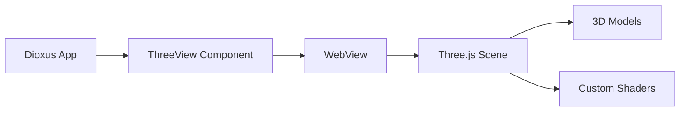

# Dioxus Three Documentation

A **Three.js 3D model viewer component** for Dioxus Desktop applications with support for custom GLSL shaders.



## Features

- 🎮 **Interactive 3D** - Render and control 3D models with ease
- 📁 **Multiple Formats** - Supports OBJ, FBX, GLTF, GLB, STL, PLY, DAE
- 🎨 **Custom Shaders** - Built-in shader presets + custom GLSL support
- 🌊 **Shader Effects** - Gradient, Water, Hologram, Toon, Heatmap
- 📷 **Camera Control** - Adjustable camera position and target
- 🔄 **Auto-rotation** - Built-in auto-rotation with speed control
- 📐 **Auto-center & Auto-scale** - Automatically fit models to viewport
- 🔲 **Wireframe Mode** - Toggle wireframe visualization

## Supported Formats

| Format | Extension | Description |
|--------|-----------|-------------|
| OBJ | `.obj` | Wavefront OBJ (most common) |
| FBX | `.fbx` | Autodesk FBX |
| glTF | `.gltf` | GL Transmission Format (JSON) |
| GLB | `.glb` | GL Transmission Format (Binary) |
| STL | `.stl` | StereoLithography (3D printing) |
| PLY | `.ply` | Stanford Polygon Library |
| DAE | `.dae` | Collada format |
| - | - | Default Cube (built-in) |

## Quick Example

```rust
use dioxus::prelude::*;
use dioxus_three::{ThreeView, ModelFormat};

fn app() -> Element {
    rsx! {
        ThreeView {
            model_url: Some("https://example.com/model.obj".to_string()),
            format: ModelFormat::Obj,
            auto_center: true,
            auto_scale: true,
            show_grid: true,
        }
    }
}
```

## Installation

Add to your `Cargo.toml`:

```toml
[dependencies]
dioxus-three = "0.1"
dioxus = { version = "0.5", features = ["desktop"] }
```

## Usage

### Basic Cube

The simplest usage - just a rotating cube:

```rust
use dioxus::prelude::*;
use dioxus_three::ThreeView;

fn app() -> Element {
    rsx! {
        ThreeView {
            auto_rotate: true,
            scale: 1.5,
            color: "#00ff00".to_string(),
        }
    }
}
```

### Load a 3D Model

```rust
use dioxus::prelude::*;
use dioxus_three::{ThreeView, ModelFormat};

fn app() -> Element {
    rsx! {
        ThreeView {
            model_url: Some("https://example.com/model.obj".to_string()),
            format: ModelFormat::Obj,
            auto_center: true,
            auto_scale: true,
            show_grid: true,
        }
    }
}
```

### Using Shader Effects

```rust
use dioxus::prelude::*;
use dioxus_three::{ThreeView, ShaderPreset};

fn app() -> Element {
    rsx! {
        // Animated gradient
        ThreeView {
            shader: ShaderPreset::Gradient,
            auto_rotate: false, // Shader has its own animation
        }
    }
}
```

### Custom Shaders

```rust
use dioxus::prelude::*;
use dioxus_three::{ThreeView, ShaderConfig};
use std::collections::HashMap;

fn app() -> Element {
    let mut uniforms = HashMap::new();
    uniforms.insert("u_intensity".to_string(), 0.5);
    
    let shader_config = ShaderConfig {
        vertex_shader: Some(r#"
            varying vec2 vUv;
            void main() {
                vUv = uv;
                gl_Position = projectionMatrix * modelViewMatrix * vec4(position, 1.0);
            }
        "#.to_string()),
        fragment_shader: Some(r#"
            uniform vec3 u_color;
            uniform float u_intensity;
            varying vec2 vUv;
            
            void main() {
                vec3 color = u_color * (0.5 + sin(vUv.x * 10.0) * u_intensity);
                gl_FragColor = vec4(color, 1.0);
            }
        "#.to_string()),
        uniforms,
        animated: false,
    };
    
    rsx! {
        ThreeView {
            shader: ShaderPreset::Custom(shader_config),
            color: "#ff0000".to_string(),
        }
    }
}
```

## Shader Presets

| Preset | Description | Animated |
|--------|-------------|----------|
| `None` | Standard PBR material | No |
| `Gradient` | Animated RGB gradient | Yes |
| `Water` | Animated water waves | Yes |
| `Hologram` | Sci-fi hologram with scanlines | Yes |
| `Toon` | Cel/toon shading | No |
| `Heatmap` | Temperature visualization | No |
| `Custom` | Your own GLSL shaders | Configurable |

## Component Props

### Model Loading

| Prop | Type | Default | Description |
|------|------|---------|-------------|
| `model_url` | `Option<String>` | `None` | URL or path to 3D model file |
| `format` | `ModelFormat` | `ModelFormat::Cube` | Model file format |
| `auto_center` | `bool` | `true` | Auto-center model on load |
| `auto_scale` | `bool` | `false` | Auto-scale to fit viewport |

### Transform

| Prop | Type | Default | Description |
|------|------|---------|-------------|
| `pos_x` | `f32` | `0.0` | X position |
| `pos_y` | `f32` | `0.0` | Y position |
| `pos_z` | `f32` | `0.0` | Z position |
| `rot_x` | `f32` | `0.0` | X rotation (degrees) |
| `rot_y` | `f32` | `0.0` | Y rotation (degrees) |
| `rot_z` | `f32` | `0.0` | Z rotation (degrees) |
| `scale` | `f32` | `1.0` | Uniform scale |

### Appearance

| Prop | Type | Default | Description |
|------|------|---------|-------------|
| `color` | `String` | `"#ff6b6b"` | Material color (hex) |
| `wireframe` | `bool` | `false` | Wireframe mode |
| `shader` | `ShaderPreset` | `ShaderPreset::None` | Shader effect |
| `background` | `String` | `"#1a1a2e"` | Background color |
| `show_grid` | `bool` | `true` | Show grid helper |
| `show_axes` | `bool` | `true` | Show axes helper |
| `shadows` | `bool` | `true` | Enable shadows |

### Camera

| Prop | Type | Default | Description |
|------|------|---------|-------------|
| `cam_x` | `f32` | `5.0` | Camera X position |
| `cam_y` | `f32` | `5.0` | Camera Y position |
| `cam_z` | `f32` | `5.0` | Camera Z position |
| `target_x` | `f32` | `0.0` | Camera target X |
| `target_y` | `f32` | `0.0` | Camera target Y |
| `target_z` | `f32` | `0.0` | Camera target Z |

### Animation

| Prop | Type | Default | Description |
|------|------|---------|-------------|
| `auto_rotate` | `bool` | `true` | Auto-rotate model |
| `rot_speed` | `f32` | `1.0` | Rotation speed multiplier |

### Styling

| Prop | Type | Default | Description |
|------|------|---------|-------------|
| `class` | `String` | `""` | Additional CSS classes |

## Demo

Run the demo application:

```bash
cd examples/demo
cargo run
```

The demo includes:
- Format selector (OBJ, FBX, GLTF, etc.)
- Model URL input
- Preset models
- **Shader effects selector**
- Transform controls
- Appearance controls
- Camera controls

## What are Shaders?

**Shaders** are small programs that run on the GPU to control how 3D objects are rendered:

- **Vertex Shaders** - Transform geometry vertices (position, deformation)
- **Fragment Shaders** - Determine pixel colors (lighting, textures, effects)

### Example Shader Effects

**Animated Gradient:**
```glsl
// Fragment shader
uniform float u_time;
varying vec3 vPosition;

void main() {
    float r = sin(vPosition.x + u_time) * 0.5 + 0.5;
    float g = sin(vPosition.y + u_time * 1.5) * 0.5 + 0.5;
    float b = sin(vPosition.z + u_time * 0.5) * 0.5 + 0.5;
    gl_FragColor = vec4(r, g, b, 1.0);
}
```

**Water Waves:**
```glsl
// Vertex shader
uniform float u_time;
varying float vElevation;

void main() {
    vec3 pos = position;
    float elevation = sin(pos.x * 4.0 + u_time) * 0.1;
    elevation += sin(pos.y * 3.0 + u_time * 0.8) * 0.1;
    pos.z += elevation;
    vElevation = elevation;
    gl_Position = projectionMatrix * modelViewMatrix * vec4(pos, 1.0);
}
```

## Loading Local Files

To load local files, serve them via HTTP:

```bash
# Serve current directory on port 8080
python3 -m http.server 8080
```

Then use `http://localhost:8080/model.obj` as the URL.

## Requirements

- Dioxus Desktop 0.5+
- Internet connection (for Three.js CDN and external models)

## Author

**Esteban Puello** - [eftech93@gmail.com](mailto:eftech93@gmail.com)

- GitHub: [@eftech93](https://github.com/eftech93)
- Repository: [github.com/eftech93/dioxus-three](https://github.com/eftech93/dioxus-three)

## License

MIT OR Apache-2.0
