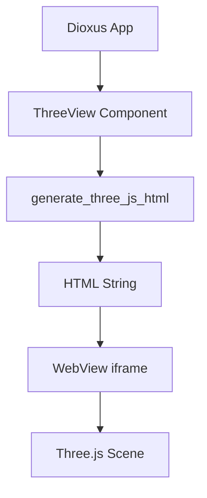
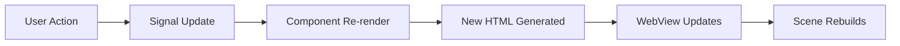
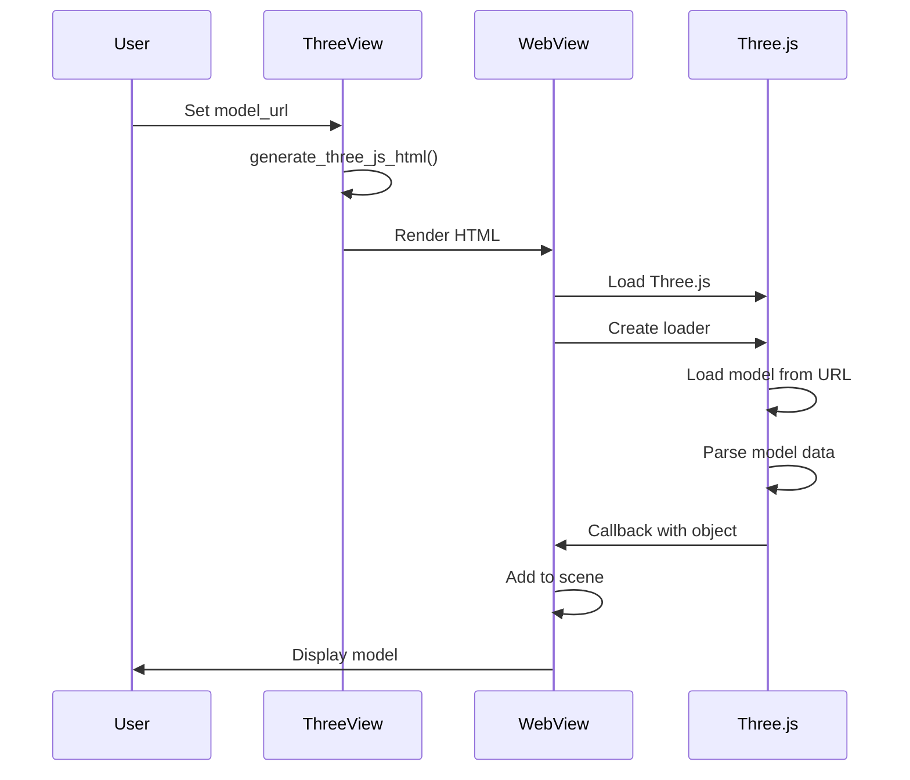

# Architecture

Understanding how Dioxus Three works internally.

## System Overview



## How It Works

1. **Props** are passed to `ThreeView`
2. **HTML Generation** creates a complete HTML document
3. **WebView** renders the HTML in an iframe
4. **Three.js** loads and renders the 3D scene

## Component Structure

```rust
#[component]
pub fn ThreeView(props: ThreeViewProps) -> Element {
    let html = generate_three_js_html(&props);
    
    rsx! {
        iframe {
            srcdoc: "{html}",
            // ...
        }
    }
}
```

## HTML Generation

The HTML includes:

1. **Three.js CDN** - Core 3D library
2. **Loader Scripts** - Format-specific loaders (OBJLoader, GLTFLoader, etc.)
3. **Scene Setup** - Camera, lights, renderer
4. **Model Loading** - Async model loading
5. **Animation Loop** - Render loop with auto-rotation

### Generated HTML Structure

```html
<!DOCTYPE html>
<html>
<head>
    <script src="three.js"></script>
    <script src="OBJLoader.js"></script>
    <style>/* Fullscreen canvas */</style>
</head>
<body>
    <div id="canvas-container"></div>
    <script>
        // Three.js scene setup
        const scene = new THREE.Scene();
        const camera = new THREE.PerspectiveCamera(...);
        const renderer = new THREE.WebGLRenderer();
        
        // Load model
        const loader = new THREE.OBJLoader();
        loader.load(url, (object) => {
            scene.add(object);
        });
        
        // Animation loop
        function animate() {
            requestAnimationFrame(animate);
            renderer.render(scene, camera);
        }
        animate();
    </script>
</body>
</html>
```

## Data Flow



**Note:** Each prop change regenerates the entire HTML. This is simple but not optimal for frequent updates.

## Model Loading Flow



## Shader System

### Built-in Shaders

Shader code is embedded in the Rust source as string literals:

```rust
impl ShaderPreset {
    fn fragment_shader(&self) -> Option<String> {
        match self {
            ShaderPreset::Gradient => {
                Some(include_str!("shaders/gradient.frag").to_string())
            }
            // ...
        }
    }
}
```

### ShaderMaterial Generation

```javascript
const shaderMaterial = new THREE.ShaderMaterial({
    uniforms: {
        u_time: { value: 0 },
        u_color: { value: new THREE.Color('#ff6b6b') }
    },
    vertexShader: `...`,
    fragmentShader: `...`,
});
```

## Loader Dependencies

Different formats require different loaders:

| Format | Loader | Extra Dependencies |
|--------|--------|-------------------|
| OBJ | OBJLoader | None |
| FBX | FBXLoader | fflate |
| GLTF/GLB | GLTFLoader | None |
| STL | STLLoader | None |
| PLY | PLYLoader | None |
| DAE | ColladaLoader | None |

## Performance Considerations

### Current Approach

- **Pros:** Simple, no Rust↔JS bridge needed
- **Cons:** Full re-render on prop changes

### Optimization Opportunities

1. **Message passing** - Send updates instead of regenerating HTML
2. **Virtual scrolling** - For multiple views
3. **Caching** - Cache loaded models in memory
4. **CDN bundling** - Bundle Three.js for offline use

## Security

- JavaScript runs in isolated WebView
- No eval() or dynamic code execution
- Models loaded from external URLs (CORS dependent)
- User shader code is escaped to prevent XSS

## Future Enhancements

- Rust↔JavaScript bridge for real-time updates
- Texture loading from URLs
- Animation playback from glTF/FBX
- Post-processing effects (bloom, DOF)
- Raycasting for click/hover events
