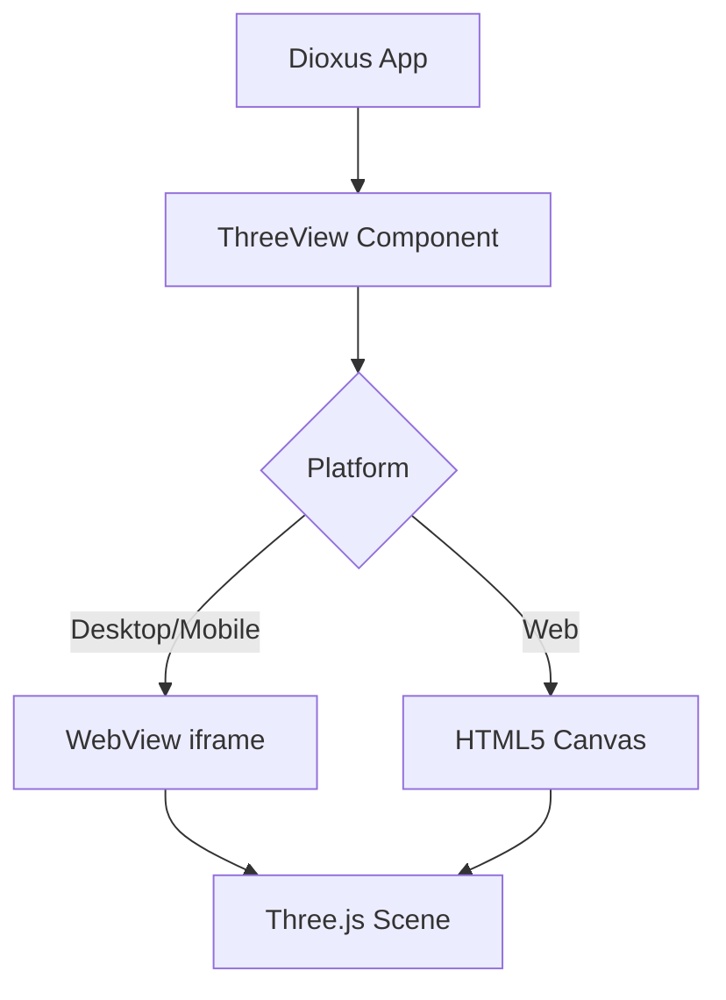
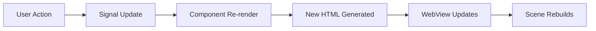
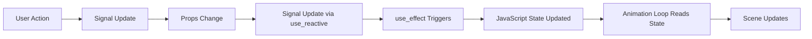
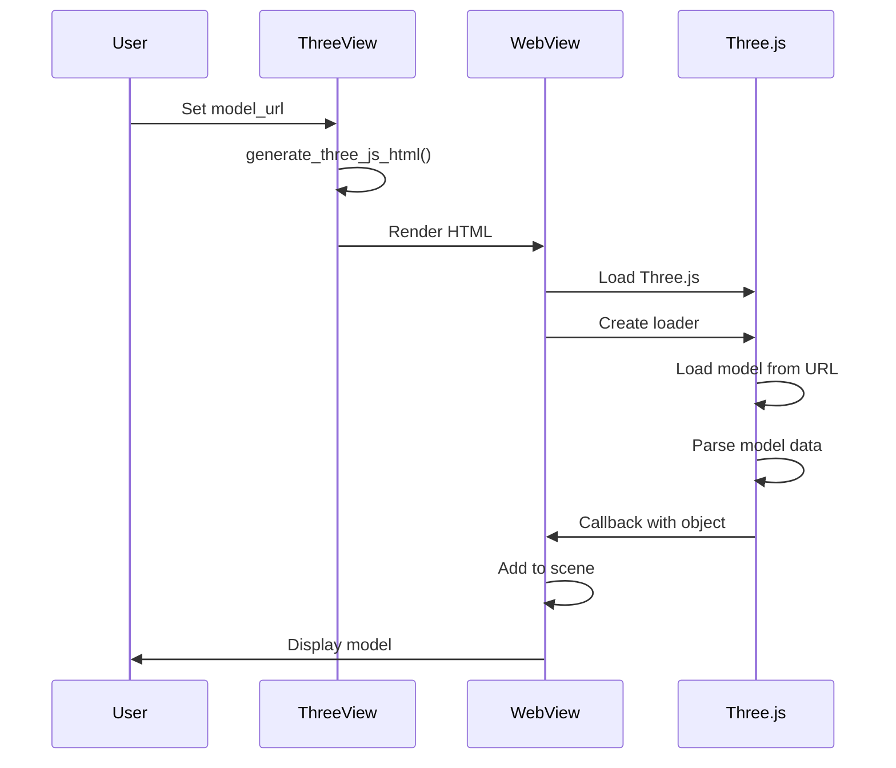
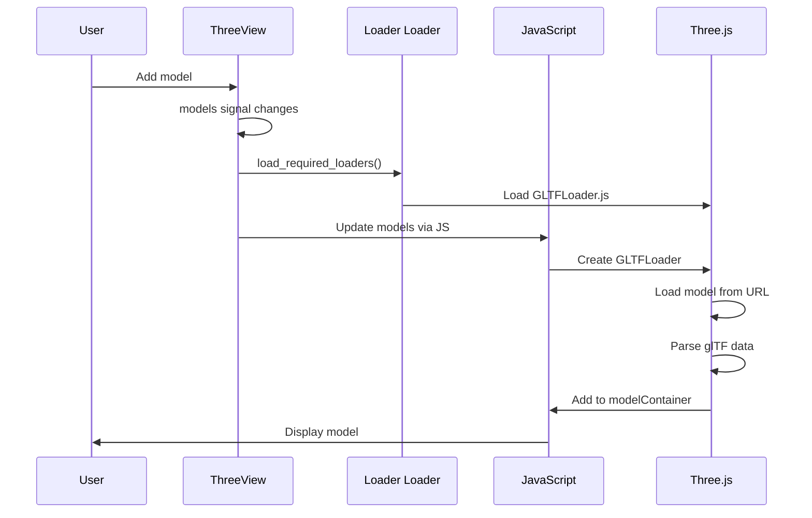

# Architecture

Understanding how Dioxus Three works internally.

## System Overview



## Platform Implementations

### Desktop & Mobile

Uses WebView with an iframe to render Three.js:

```rust
#[component]
pub fn ThreeView(props: ThreeViewProps) -> Element {
    let html = generate_three_js_html(&props);
    
    rsx! {
        iframe {
            srcdoc: "{html}",
            // ...
        }
    }
}
```

**Characteristics:**
- Generates complete HTML document
- Full re-render on prop changes
- Simple but not optimal for frequent updates

### Web (WASM)

Uses HTML5 Canvas with direct Three.js integration:

```rust
#[component]
pub fn ThreeView(props: ThreeViewProps) -> Element {
    // Store props in signals
    let mut cam_x = use_signal(|| props.cam_x);
    // ...
    
    // Update signals when props change
    use_effect(use_reactive((&props,), move |(new_props,)| {
        cam_x.set(new_props.cam_x);
        // ...
    }));
    
    // Effect runs when signals change
    use_effect(move || {
        let cx = cam_x(); // Subscribe to changes
        // Update JavaScript state
        update_scene(cx, ...);
    });
    
    rsx! {
        canvas {
            // ...
        }
    }
}
```

**Characteristics:**
- Real-time state synchronization
- Efficient updates without full re-renders
- JavaScript state object on canvas element

## Data Flow

### Desktop/Mobile



### Web



## HTML Generation

The HTML includes:

1. **Three.js CDN** - Core 3D library
2. **Loader Scripts** - Format-specific loaders (OBJLoader, GLTFLoader, etc.)
3. **Scene Setup** - Camera, lights, renderer
4. **Model Loading** - Async model loading
5. **Animation Loop** - Render loop with auto-rotation

### Generated HTML Structure (Desktop/Mobile)

```html
<!DOCTYPE html>
<html>
<head>
    <script src="three.js"></script>
    <script src="OBJLoader.js"></script>
    <style>/* Fullscreen canvas */</style>
</head>
<body>
    <div id="canvas-container"></div>
    <script>
        // Three.js scene setup
        const scene = new THREE.Scene();
        const camera = new THREE.PerspectiveCamera(...);
        const renderer = new THREE.WebGLRenderer();
        
        // Load model
        const loader = new THREE.OBJLoader();
        loader.load(url, (object) => {
            scene.add(object);
        });
        
        // Animation loop
        function animate() {
            requestAnimationFrame(animate);
            renderer.render(scene, camera);
        }
        animate();
    </script>
</body>
</html>
```

## Web Implementation Details

### State Management

JavaScript state is stored on the canvas element:

```javascript
const state = {
    camX: 8, camY: 8, camZ: 8,
    rotX: 0, rotY: 0, rotZ: 0,
    autoRotate: true,
    scale: 1.0,
    // ...
};

canvas.dioxusThreeState = state;
```

### Animation Loop

The animation loop reads from state every frame:

```javascript
function animate() {
    requestAnimationFrame(animate);
    
    // Update camera from state
    camera.position.set(state.camX, state.camY, state.camZ);
    
    // Update transforms from state
    modelContainer.scale.setScalar(state.scale);
    
    if (state.autoRotate) {
        autoRotY += state.rotSpeed * 0.01;
        modelContainer.rotation.y = state.rotY + autoRotY;
    }
    
    renderer.render(scene, camera);
}
```

### Loader Loading

Format-specific loaders are loaded dynamically:

```rust
async fn load_required_loaders(models: &[ModelConfig]) {
    // Collect unique formats
    let unique_formats = // ...
    
    // Load each required loader
    for format in &unique_formats {
        let loader_url = get_loader_url(format);
        load_script(&document, loader_url).await;
    }
}
```

## Model Loading Flow

### Desktop/Mobile



### Web



## Shader System

### Built-in Shaders

Shader code is embedded in the Rust source as string literals:

```rust
impl ShaderPreset {
    fn fragment_shader(&self) -> Option<String> {
        match self {
            ShaderPreset::Gradient => {
                Some(include_str!("shaders/gradient.frag").to_string())
            }
            // ...
        }
    }
}
```

### ShaderMaterial Generation

```javascript
const shaderMaterial = new THREE.ShaderMaterial({
    uniforms: {
        u_time: { value: 0 },
        u_color: { value: new THREE.Color('#ff6b6b') }
    },
    vertexShader: `...`,
    fragmentShader: `...`,
});
```

## Loader Dependencies

Different formats require different loaders:

| Format | Loader | Extra Dependencies |
|--------|--------|-------------------|
| OBJ | OBJLoader | None |
| FBX | FBXLoader | fflate |
| GLTF/GLB | GLTFLoader | None |
| STL | STLLoader | None |
| PLY | PLYLoader | None |
| DAE | ColladaLoader | None |

## Performance Considerations

### Desktop/Mobile

- **Pros:** Simple, no Rust↔JS bridge needed
- **Cons:** Full re-render on prop changes

### Web

- **Pros:** Efficient updates, real-time state sync
- **Cons:** More complex implementation

### Optimization Opportunities

1. **Message passing** - Send updates instead of regenerating HTML (desktop)
2. **Virtual scrolling** - For multiple views
3. **Caching** - Cache loaded models in memory
4. **CDN bundling** - Bundle Three.js for offline use

## Security

- JavaScript runs in isolated WebView (desktop/mobile)
- No eval() or dynamic code execution
- Models loaded from external URLs (CORS dependent)
- User shader code is escaped to prevent XSS

## Future Enhancements

- Rust↔JavaScript bridge for real-time updates (desktop)
- Texture loading from URLs
- Animation playback from glTF/FBX
- Post-processing effects (bloom, DOF)
- Raycasting for click/hover events
