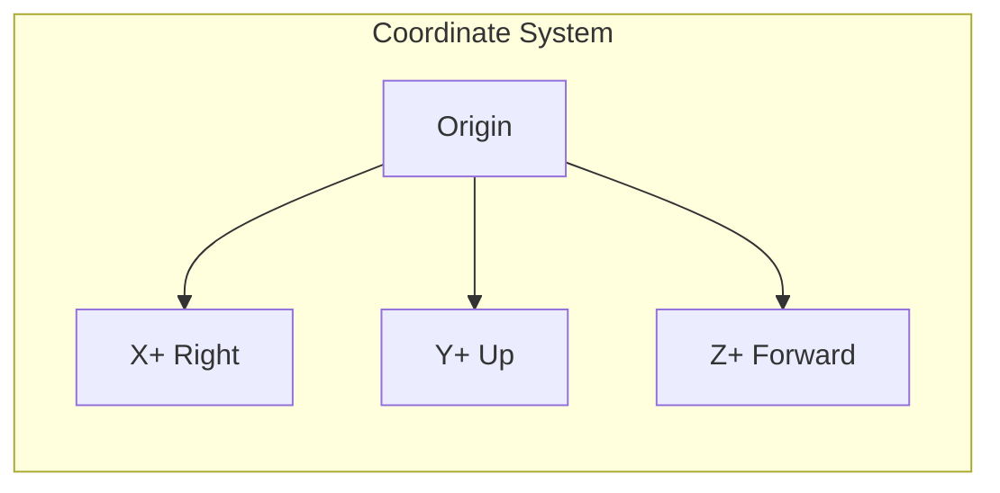

# Transform Controls

Control the position, rotation, and scale of your 3D models.

## Position

Move the model in 3D space:

```rust
rsx! {
    ThreeView {
        pos_x: 2.0,   // Move right
        pos_y: 1.0,   // Move up
        pos_z: -3.0,  // Move back
    }
}
```

## Rotation

Rotate the model (in degrees):

```rust
rsx! {
    ThreeView {
        rot_x: 45.0,  // Pitch
        rot_y: 90.0,  // Yaw
        rot_z: 0.0,   // Roll
    }
}
```

### Interactive Rotation

```rust
fn app() -> Element {
    let mut rot_x = use_signal(|| 0.0f32);
    let mut rot_y = use_signal(|| 0.0f32);
    
    rsx! {
        div { style: "display: flex; height: 100vh;",
            div { style: "width: 250px; padding: 20px;",
                input {
                    r#type: "range",
                    min: "0",
                    max: "360",
                    value: "{rot_x()}",
                    oninput: move |e| rot_x.set(e.value().parse().unwrap_or(0.0))
                }
                input {
                    r#type: "range",
                    min: "0",
                    max: "360",
                    value: "{rot_y()}",
                    oninput: move |e| rot_y.set(e.value().parse().unwrap_or(0.0))
                }
            }
            
            ThreeView {
                rot_x: rot_x(),
                rot_y: rot_y(),
                auto_rotate: false,  // Disable auto-rotation for manual control
            }
        }
    }
}
```

## Scale

Uniform scaling:

```rust
rsx! {
    ThreeView {
        scale: 2.0,  // Double size
    }
}
```

### Dynamic Scaling

```rust
fn app() -> Element {
    let mut scale = use_signal(|| 1.0f32);
    
    rsx! {
        div { style: "display: flex; height: 100vh;",
            div { style: "width: 200px; padding: 20px;",
                button { onclick: move |_| scale.set(scale() * 1.1), "Zoom In" }
                button { onclick: move |_| scale.set(scale() * 0.9), "Zoom Out" }
                button { onclick: move |_| scale.set(1.0), "Reset" }
            }
            
            ThreeView {
                scale: scale(),
            }
        }
    }
}
```

## Combining Transformations

All transforms work together:

```rust
rsx! {
    ThreeView {
        // Position
        pos_x: 1.0,
        pos_y: 0.5,
        pos_z: 0.0,
        
        // Rotation
        rot_x: 30.0,
        rot_y: 45.0,
        rot_z: 0.0,
        
        // Scale
        scale: 1.5,
    }
}
```

## Auto-Rotate vs Manual Rotation

When `auto_rotate` is true, the Y rotation is overridden by the animation:

```rust
rsx! {
    // Manual control (auto_rotate off)
    ThreeView {
        auto_rotate: false,
        rot_y: 45.0,  // This works
    }
    
    // Auto rotation (overrides rot_y)
    ThreeView {
        auto_rotate: true,
        rot_y: 45.0,  // This is ignored during animation
        rot_speed: 2.0,  // Animation speed
    }
}
```

## Coordinate System

Dioxus Three uses a right-handed coordinate system:

- **X+** → Right
- **Y+** → Up  
- **Z+** → Towards viewer (out of screen)



## Reset Transform

Create a reset button:

```rust
fn app() -> Element {
    let mut pos = use_signal(|| (0.0f32, 0.0f32, 0.0f32));
    let mut rot = use_signal(|| (0.0f32, 0.0f32, 0.0f32));
    let mut scale = use_signal(|| 1.0f32);
    
    let reset = move || {
        pos.set((0.0, 0.0, 0.0));
        rot.set((0.0, 0.0, 0.0));
        scale.set(1.0);
    };
    
    rsx! {
        div { style: "display: flex; height: 100vh;",
            button { onclick: move |_| reset(), "Reset Transform" }
            
            ThreeView {
                pos_x: pos().0,
                pos_y: pos().1,
                pos_z: pos().2,
                rot_x: rot().0,
                rot_y: rot().1,
                rot_z: rot().2,
                scale: scale(),
            }
        }
    }
}
```
